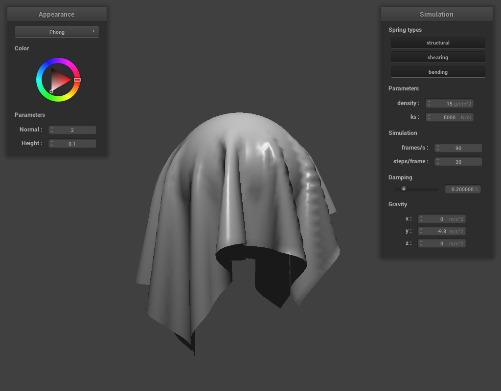

<style>
          body {
    padding: 100px;
    width: 1400px;
    margin: auto;
    text-align: left;
    font-weight: 300;
    font-family: 'Open Sans', sans-serif;
    color: #121212;
  }
  h1, h2, h3, h4 {
    font-family: 'Source Sans Pro', sans-serif;
  }
</style>

# <center> **CS 184: Computer Graphics and Imaging, Spring 2021** <!-- omit in toc -->

## <center> **Project 4: Cloth Sim** <!-- omit in toc -->

## <center> **Frank Warren** </center> <!-- omit in toc -->

## **Contents** <!-- omit in toc -->
- [**Overview**](#overview)
- [**Part 1: Masses and springs**](#part-1-masses-and-springs)
- [**Part 2: Simulation via numerical integration**](#part-2-simulation-via-numerical-integration)
- [**Part 3: Handling collisions with other objects**](#part-3-handling-collisions-with-other-objects)
- [**Part 4: Handling self-collisions**](#part-4-handling-self-collisions)
- [**Part 5: Shaders**](#part-5-shaders)

<br />

## **Overview**

The purpose of this project is to implement a real-time simulation of cloth using a mass and spring based system. Many physical systems can be simulated in this way. Besides cloth, we can use this model to simulate Things like hair, skin, liquids, air, and so on. The bulk of the complexity of this is in implementing efficient data structures to represent the cloth and implementing numerical integration methods that are simple, efficient, and stable.

<br />

## **Part 1: Masses and springs**

The first part of this project involves implementing data structures that represent our system of masses and springs. Specifically for this project, we will be simulating cloth. To do this, we create a cloth of some `width * height` size, where the bottom left of the cloth is at the origin. The cloth is composed of `num_width_points * num_height_points` point masses. Springs can connect point masses. There are 3 different types of springs, and the distribution of springs follows some basic rules:

1. `STRUCTURAL` springs exist between any point mass and the point mass to its left as well as the point mass above it. Like the name suggests, these springs form the structure of our cloth.
2. `SHEARING` springs exist between a piont mass and the point mass to its upper left and the point mass to its upper right (diagonals). These springs help prevent the cloth from shearing.
3. `BENDING` springs exist between a point mass and the point mass two away from its left as well as the one two above it. These springs help the cloth resist folding out of the plane.

We use 3 different types of springs because we want to control each type of spring's "stiffness", giving us more control over the cloth's behaviour. Here are some images that show structure of a cloth as well as the different types of springs.  

| |  |  |
|:-----------------------:|:------------------------:|:------------------------:|
| **No shearing springs**| **Only shearing springs**| **All spring types** |

<br />  <br />

## **Part 2: Simulation via numerical integration**

After we have implemented our representation of springs, point masses, and spring-mass meshes, we need to implement the physical equations and govern the forces acting on our system. There are different types of forces that may affect our system, but we will divide them into external and internal forces. External forces may be things like gravity, wind, etc. Internal forces are the ones resulting from the springs. An ideal spring can be neatly modeled as a function of the length of the spring (the distance between the two point masses) multiplied by a "spring constant" (the *stiffness* of the spring). This is known as [Hooke's Law](https://en.wikipedia.org/wiki/Hooke%27s_law):  

$$\vec{f_s} = k_s (\vec{b}-\vec{a}) \qquad \text{Hooke's Law}$$

However, in this equation, contracting force of a spring will only be 0 when $\vec{b} - \vec{a} = 0$, i.e.the spring has 0 length. To counteract this, we need modify our equation such that the spring fore is 0 when it is at its "rest length" $l$:  

$$\vec{f_s} = k_s \frac{\vec{b} - \vec{a}}{|| \vec{b} - \vec{a} ||}(||\vec{b} - \vec{a}|| - l) \qquad \text{Hooke's Law with rest length}$$

However, in this equation, the spring will just oscillate forever since there's no kind of drag or dampening that opposes it. We also need to define a dampening force that opposes the spring force is a function of some "dampening coefficient" $k_d$ and the velocity of the masses. (i.e. the dampening force is greater at higher speeds) It's important to note that *we only want to dampen forces in the direction of the spring*, meaning we dont want to dampen the effects of gravity, or other external forces. Here is our dampening force: 

$$\vec{f_d} = -k_d \frac{\vec{b} - \vec{a}}{|| \vec{b} - \vec{a} ||}(\vec{b}' - \vec{a}') \cdot \frac{\vec{b} - \vec{a}}{|| \vec{b} - \vec{a} ||} \qquad \text{Dampening force}$$

Once we have defined the physical equations that will govern our system, we need to figure out how we will use them to simulate the system as it progresses through time. In this project, we use a simple method called [Euler's Method](https://en.wikipedia.org/wiki/Euler_method). Euler's method is basically just starting with some known initial values for a differential equation, then just repeatedly plugging in those values and the resulting values to find the values at future timesteps:  

$$
x(t + \Delta t) = x(t) + \Delta t \cdot x'(t) \qquad \text{New particle position is its last position plus the effect of velocity times $\Delta t$} \qquad \qquad \qquad \qquad \quad  \\ \ \\
\  x'(t + \Delta t) = x'(t) + \Delta t \cdot x''(t) \qquad \text{New particle velocity is its previous velocity plus the amount of acceleration applied over $\Delta t$ time}
$$

This is basically guessing, and as the time divisions $\Delta t$ get finer, our simulation becomes more accurate. However, a major problem with this method is that it can be instable even with arbitrarily small time divisions. In our system, instability occurs when springs are stretch unreasonable amounts during a timestep. There are various methods for combating instability, but in this project we will use [Verlet integration](https://en.wikipedia.org/wiki/Verlet_integration). We use Verlet integration because it is fast to calculate, easy to implement, and prevents exactly the type of instability that can occur in our system. In Verlet integration, we simply constrain the positions of our masses such that after any given timestep the spring's length is at most $10\%$ greater than the spring's `rest_length`. Here's some pseudocode for how these constraints work:  

```C++
// After the Euler timestep calculations
for (each spring in the system) {
    if (spring.length > 1.10 * spring.rest_length) {
        if (!spring.massA.isPinned() && !spring.massB.isPinned())
            // move both masses toward each other such that spring.length = 1.10 * spring.rest_length
        else if (!spring.massA.isPinned())
            // move only massB toward massA
        else if (!spring.massB.isPinned())
            // move only massA toward massB
    }
}
```

After implementing the physical equations of the system and the constraints, we can perform basic real-time simulations of cloth! Here are some videos and images demonstrating our cloth simulation after this part was completed. Each set of pictures and videos has the same settings except for one parameter which is shown at low and high values to demonstrate how it affects the cloth. Some of the settings include cloth density, spring types, spring constant, dampening, and gravity.

| <video width = "680" height="480" controls> <source src = "./vids/low_ks.mp4"> | </video> <video width = "680" height="480" controls> <source src = "./vids/high_ks.mp4"> </video> |
|:--:|:--:|
| **Small $k_s$** <br /> Notice how, when the cloth falls, a clear wave propogates from the pinned corners toward the bottom of the cloth. When the wave reaches the bottom of the cloth, it causes it to flap. When the cloth is at rest, it sags a large amount between the pinned corners.| **Large $k_s$** <br /> When this cloth falls there is also a wave, but the "width" of the wave is much larger than in the small $k_s$ case. This makes sense because, in this case, the springs resist deformation much more. Also, when this cloth is at rest, it does not sag nearly as much. |

| |  |
|:-----------------------:|:------------------------:|
| **Low density** <br /> When the cloth has lower density, each of the point-masses have lower mass. That means that the force from gravity on each mass is less. This is why, for this low density cloth, we don't see a huge amount of sag.| **High density** <br /> At higher density, each of the point-masses experience greater force from gravity. We can see that, in this high density cloth, there is a much greater amount of sag. Also, there are no wrinkles. This is becuase the force from gravity acting on each mass (which acts parallel to the cloth plane) is much stronger than the forces from the bending springs which attempt to pull masses out of the cloth plane.

<br />

| <video width = "680" height="480" controls> <source src = "./vids/low_damping.mp4"> | </video> <video width = "680" height="480" controls> <source src = "./vids/high_damping.mp4"> </video> |
|:--:|:--:|
| **Low damping** <br /> At a low damping value, waves in the cloth propogate more freely. The cloth is visibly less stiff. When the cloth reaches its lowest point, it can be seen to stretch a bit then contract. The force from this pushes it away from its lowest point. Low damping values are probably useful for simulating liquids.  | **High damping** <br /> At a high damping value, the cloth barely has any waves on its surface. It is visibly much more rigid. When it reaches the bottom, it stops moving almost immediately. With high damping, the cloth falls more slowly because we implemented a simpler version of damping that dampens all forces (not just the spring force). |

|  |
|:------------------------:|
| **This is the final resting position of a cloth with 4 pinned corners under default parameters.**  

<br />

## **Part 3: Handling collisions with other objects**

We have just implemented the physical simulation of gravity interacting with cloth. Now, we want to simulate the interactions of cloth with other objects. To do this, we need to add support for collisions between cloth and other objects. In this part, we will implement collisions between spheres and planes. This is mainly achieved using the `collide` method, which are methods in sphere and plane objects. The `collide` method checks whether or not a given point mass is inside of the given object.  

A sphere is defined with its origin (center) and radius. We know a point is inside a sphere if the distance between the point and the sphere's center is less than or equal to the sphere's radius:

```CPP
bool insideSphere(Vector3D point, Sphere sphere) {
    return (point - sphere.center).norm() <= radius;
}
```

If a point mass is inside the sphere, we need to compute where the point mass would've intersected the sphere using the point mass position and the sphere origin. Once we know where the point mass would have intersected the sphere's surface, we need to compute the vector needed that, when applied to the point mass's `last_position`, will make the point mass's position to the intersection point. Then, we let the point mass's new position be its `last_position` scaled down by a friction term $(1 - f)$. After this is done, we offset the new point mass location by a very small amount `SURFACE_OFFSET` away from the plane toward its last position so that point masses are always sitting on top of and not inside of the plane.  

Here's some examples of collisions with spheres and planes:

| <video width = "680" height="480" controls> <source src = "./vids/sphere_collision1.mp4"> | </video> <video width = "680" height="480" controls> <source src = "./vids/sphere_collision2.mp4"> </video> |
|:--:|:--:|
| **Sphere collision with $k_s = 500 \ N/m$** <br /> Compared to cloth with greater spring constants, this cloth deforms much more when colliding with the sphere. Also, the cloth has many small, high speed waves on its surface when colliding with the sphere. At rest, this cloth snugly hugs the sphere like a thin, wet piece of fabric might in real life. | **Sphere collision with $k_s = 5000 \ N/m$** <br /> This cloth shows deformation, wave formation, and resting behaviors between the $k_s = 500 \ N/m$ cloth and the $k_s = 50,000 \ N/m$ cloth. |
| <video width="680" height="480" controls> <source src="./vids/sphere_collision3.mp4"> | <video width="680" height="480" controls> <source src="./vids/plane_collision.mp4"> |  
| **Sphere collision with $k_s = 50,000 \ N/m$** <br /> This cloth deforms much less on collision than the $k_s = 500 \ N/m$ cloth. There isn't very many waves that can be seen on this cloth's surface. When the cloth is at rest, it doesn't cling to the sphere as much as cloth with lesser spring constants. This cloth behaves how one might imagine a thicker, dry fabric would behave. | **Plane collision** <br /> Not much to see here...|

<br />

## **Part 4: Handling self-collisions**

You may have noticed in the sphere collision videos that the cloth passes through itself instead of self-colliding. The naive method that first comes to mind is to loop through each mass and check which masses are within a certain threshold distance of it and changing the forces on these pairs so that they are no longer within that threshold distance of each other. However, in this naive implementation, we are have to check every possible pair of points, which means we are performing $O(n^2)$ checks and possible operations, which becomes very slow, very quickly.  

A different technique for handling self-collisions is called [spatial hashing](https://en.wikipedia.org/wiki/Geometric_hashing). At each time step, we build a hash table that maps $\tt float \rightarrow{vector<PointMass *>}$. The float uniquely represents a 3D box. The vector that the float maps to contains all of the point masses inside that box. Once we have built this hash table, we can simply loop through the point masses and use the hash table to lookup the box containing a point mass, then check (and fix, if necessary) only the point masses that are in the same box as it. It's been a long time since I took 61b, so I couldn't really remember the technical details of hash functions. The key points I remembered was that a hash function takes a thing and assigns it a bin, and a good hash function assigns things to bins fairly equally. To hash 3D positions, I decided to add up the 3 coordinates. Then, I realized that there are many different combinations of coordinates that sum to the same number. So, I threw in some prime numbers because I faintly remember that prime numbers are useful anytime you trying to get things to be unique.

Here are 3 videos of the cloth falling straight down to demonstrate its newfound self-collision abilities:  

| <video width = "680" height="480" controls> <source src = "./vids/self_collision1.mp4"> | </video> <video width = "680" height="480" controls> <source src = "./vids/self_collision2.mp4"> </video> |
|:--:|:--:|
| **Self collision under standard parameters** <br /> Not much to see here, just a cloth falling on itself | **Self collision with very low density** <br />  We can see that the cloth folds into nice curves like a piece of ribbon candy. This is because at low density, the force due to gravity is much less than the bending and self-collision forces, making the cloth move out of the plane rather than forming sharp creases.    |
| <video width = "680" height="480" controls> <source src = "./vids/sphere_collision1.mp4"> | |
| **Self collision with very high $k_s$** <br /> Having large spring constants achieves a similar effect to having low density. If we don't change density, we can make our springs more stiff to overcome the force due to gravity. |


<br />

## **Part 5: Shaders**

In our raytracer project, we did all of our computation on the CPU. Because of this, it took a very long time to render scenes. Instead of relying entirely on the CPU, we can use a Graphics Processing Unit for dedicated graphics processing. GPUs can be entirely separate hardware on a computer (graphics cards), but many CPUs come with integrated GPUs.  

Shaders are programs that run in parallel on GPU. They execute parts of the graphics pipeline much more efficiently than programs that rely on a computer's CPU. In this project, we will using a programming language called [OpenGL Shading Language](!https://en.wikipedia.org/wiki/OpenGL_Shading_Language)(GLSL) to write our shaders. Luckily for us, GLSL is syntatically similar to the C programming language. The reason why there is a special programming language for writing shaders is because it is designed to give programmers more direct control of the graphics pipeline and to simplify the calculations inherent to graphics processing.  

In this project, there are two basic types of OpenGL shaders that will be used:

- **Vertex shaders** : these generally deal with and apply transforms to vertices. Basically, vertex shaders handle the geometric properties of a scene
- **Fragment shaders** : these shaders take in the geometric attributes of a scene and handle the lighting of the scene

To create a full shader program, we link a vertex shader and a fragment shader. The vertex shader outputs the geometry of a scene to the fragment shader, then the fragment shader determines the lighting. In this project, we implemented multiple types of shaders.  

### **Blinn-Phong shading** <!-- omit in toc -->

In the Blinn-Phong shading model, we start by calculating the results from applying diffuse shading (brightness of a spot is determined by the angle formed with the light source). After we have the light resulting from diffuse reflection, we calculate the light that results from specular reflection. This combination of diffuse and specular reflection is the Blinn-Phong model. The contribution of diffuse lighting vs specular lighting at a point is governed by a diffuse and specular coefficient, respectively. (i.e. these coefficients tell us how light interacts with the surface)

Here's some examples of Blinn-Phong shading under different settings.

|  |  |
|:--:|:--:|
|**Only ambient component**|**Only diffuse component**|
| |  |
|**Only specular component** | **Entire Blinn-Phong model** |

<br />

### **Custom Texture** <!-- omit in toc -->

We can use any image as a texture. Here's a random image I downloaded and used as a texture.

| <video width = "680" height="480" controls> <source src = "./vids/texture.mp4"> |
|:--:|
|**Yeehaw**|

<br />

### **Bump mapping and displacement mapping** <!-- omit in toc -->

Bump mapping is a technique for *simulating* textured surfaces by altering the light by some displacement vector. Displacement mapping is a technique to create textured surfaces by altering the geometry of an object. Here's some examples showing the differences between the two techniques.

|  |  |
|:--:|:--:|
|**Bump mapping on the sphere**|**Bump mapping on the cloth** <br /> Notice how the cloth seems perfectly flat, even though the image printed gives the illusion of it being some kind of woven fabric.|

|  |  |
|:--:|:--:|
|**Displacement mapping on the sphere**|**Displacement mapping on the cloth** <br /> Now, the cloth looks likes it's actually woven out of 3d fibers.|

|  |  |
|:--:|:--:|
|**Bump mapping on a coarse sphere**|**Bump mapping on a fine sphere** <br /> Not much difference can really be seen here. Since bump mapping doesn't have an affect on the geometry of objects.|

|  |  |
|:--:|:--:|
|**Displacement mapping on a coarse sphere**|**Displacement mapping on a fine sphere** <br /> We can see that the raised surfaces are a bit smoother when we have a higher resolution sphere. (change in height between vertices is more gradual)|

### **Mirror** <!-- omit in toc -->

The last shader is one that simulates a mirror surface. We use some of the same concepts as we did in ray-tracing, namely projecting a ray from the camera to a vertex, then determining the direction that light would have to come from to reflect from that vertex to the camera. In this shader, the light is coming from all around the scene at infinite distance, just like environmental lighting.

<br />

|  |  |
|:--:|:--:|
|**Mirror cloth on sphere**|**Mirror and cloth seperate**|